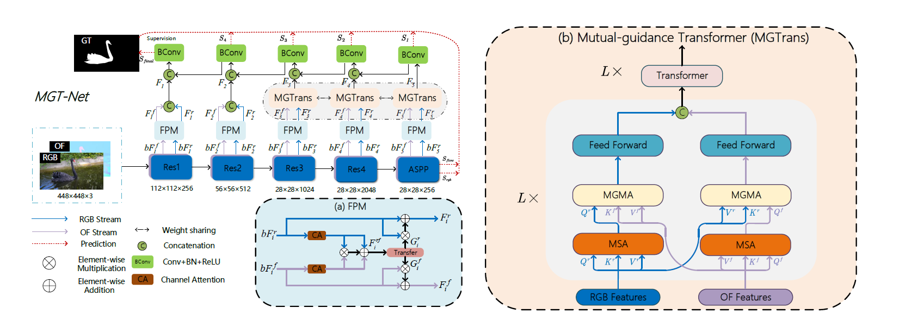
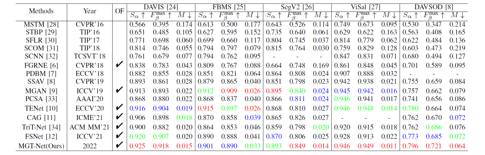

# MGT-Net
Official code repository for paper [Mutual-Guidance Transformer-Embedding Network for Video Salient Object Detection](https://ieeexplore.ieee.org/abstract/document/9834060)

<p align="center">
     <br />
 <em> 
    Overall framework of the proposed MGT-Net. The two input streams (RGB and OF) use the same symmetric network structure.
    </em>
</p>

## Usage

**Each dataset corresponds to a txt path file, with each row arranged by img_path, gt_path and flow_path.**

### Training
1. Download the train dataset (contains DAVIS16, DAVSOD, FBMS and DUTS-TR) from [Baidu Driver](https://pan.baidu.com/s/1F2RrcgJylUMYkWiUAoaL2A)(PSW:wuqv).
2. Download the pre_trained ResNet50 [backbone](https://download.pytorch.org/models/resnet50-19c8e357.pth) and Vit-B_16 [backbone](https://pan.baidu.com/s/1t-G8k8J3jCCWoh6uJbnBzQ)(PSW:zouw) to your specified folder.
3. The training of entire model is implemented on four NVIDIA TiTAN X GPUs:
- Run `CUDA_VISIBLE_DEVICES=0,1,2,3 python -m torch.distributed.launch --nproc_per_node=4 train_distribute.py`

### Testing
1. Download the test dataset  (contains DAVIS16, DAVSOD, FBMS, SegTrack-V2 and VOS) from [Baidu Driver](https://pan.baidu.com/s/1F2RrcgJylUMYkWiUAoaL2A)(PSW:wuqv).
2. Download the final trained model from [Baidu Driver](https://pan.baidu.com/s/1ldgE0fYF2rFzrCHonVLmrw)(PSW:yl8s).
3. Run `python test.py`.

## Result
1. The saliency maps can be download from [Baidu Driver](https://pan.baidu.com/s/1Pw9mrsoTxNM8x7GEpFoSIw) (PSW: 9oqe)
2. Evaluation Toolbox: We use the standard evaluation toolbox from [DAVSOD benchmark](https://github.com/DengPingFan/DAVSOD).



<p align="center">
     <br />
 <em> 
    QUANTITATIVE COMPARISON WITH SOTA METHODS ON FIVE PUBLIC DATASETS IN TERM OF THREE METRICS. THE TOP THREE RESULTS ARE HIGHLIGHTED IN RED, GREEN, AND BLUE, RESPECTIVELY. OF COLUMN MEANS IF OF IS USED AS INPUT.
    </em>
</p>

## Citation
Please cite the following paper if you use this repository in your research:
```
@article{min2022mutual,
  title={Mutual-Guidance Transformer-Embedding Network for Video Salient Object Detection},
  author={Min, Dingyao and Zhang, Chao and Lu, Yukang and Fu, Keren and Zhao, Qijun},
  journal={IEEE Signal Processing Letters},
  volume={29},
  pages={1674--1678},
  year={2022},
  publisher={IEEE}
}
```
